# fluffy-happiness

### 1. 프로젝트 개요

- 프로젝트 이름: fluffy-happiness

- 프로젝트 주제: 추천 알고리즘을 적용한 영화 커뮤니티 사이트

- 기술 스택:       

- 기간: 11.17 ~ 11.25 (목, 18:00까지)

- 발표: 11.26 (금, 종강식날)

- 팀원: 🤛`김경수`, `최광호`🤜

- 진행 by `github`

  github을 통해 issue 및 타임라인 관리

  wiki를 활용하여 그날 그날의 이슈들을 정리

  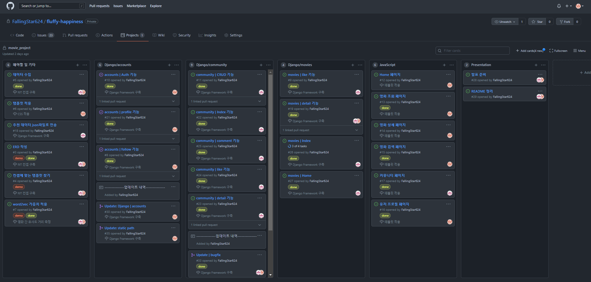

### 2. 프로젝트 컨셉

- 컨셉

  - 검은색과/노란색/흰색을 사용하여 영화관의 느낌으로 전체적으로 영화관에 있는 듯한 느낌을 사용자에게 제공
  - 영화를 위한 공간과 영화 리뷰를 위한 공간을 분리하여 각각 `Movie`와 `Review`로 구현

  - 페이지 구성

     |                   |             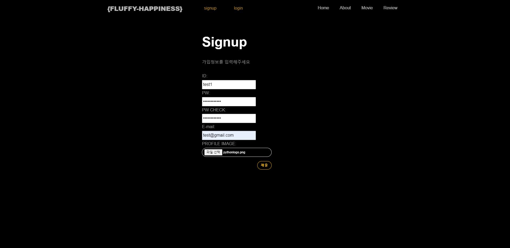              |                             |
    | :----------------------------------------------------------: | :----------------------------------------------------------: | :----------------------------------------------------------: |
    |                      `Anonymous Home `                       |                           `Signup`                           |                           `Login`                            |
    |             |  |      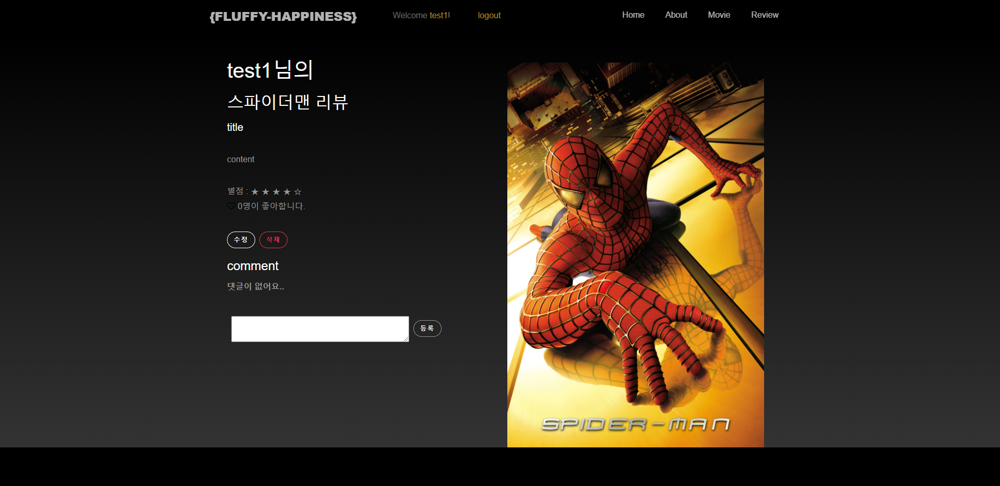       |
    |                       `Review Create`                        |                 `Review Create Autocomplete`                 |                       `Review Detail`                        |
    |                 | 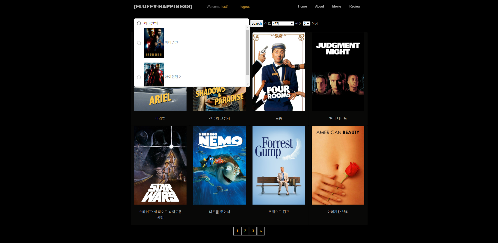 |           |
    |                        `Movie Index`                         |                  `Movie Index Autocomplete`                  |                    `Movie Detail Trailer`                    |
    |           |         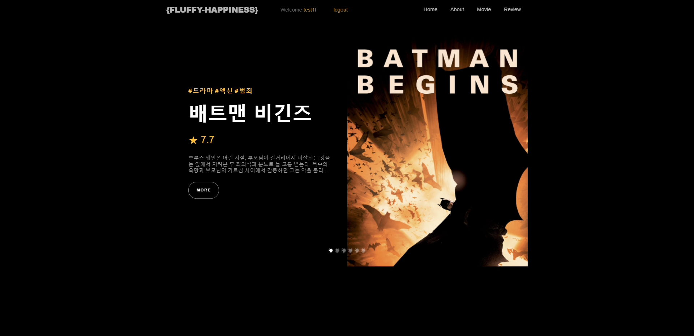          | 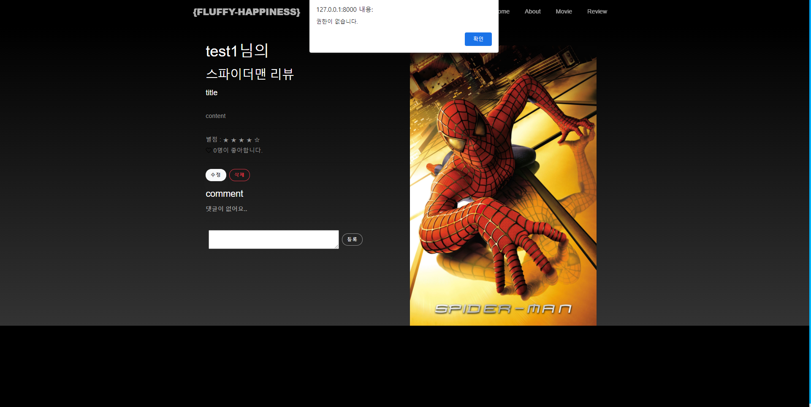 |
    |                   `Movie Detail Recommend`                   |                         `User Home`                          |               `Review Authority Verification`                |
    | 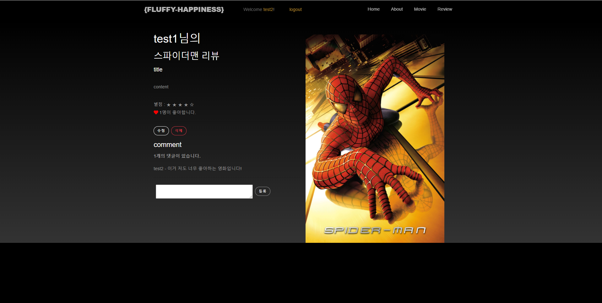 | 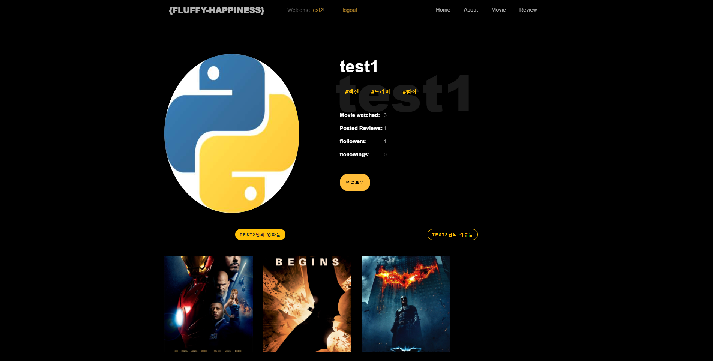  |       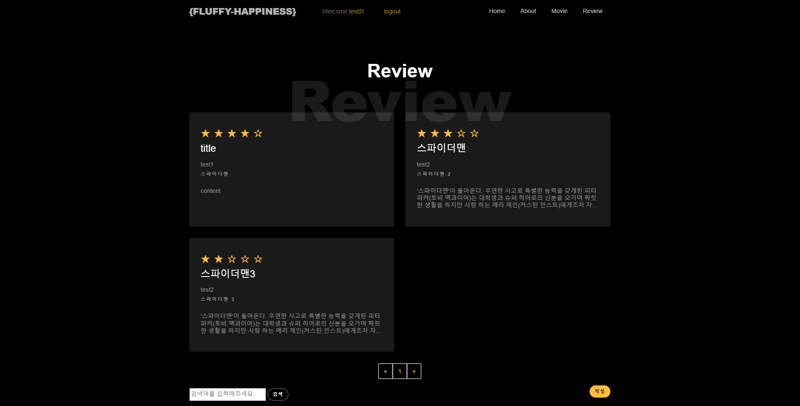        |
    |                      `Like and Comment`                      |                        `User Profile`                        |                        `Review Index`                        |
    |      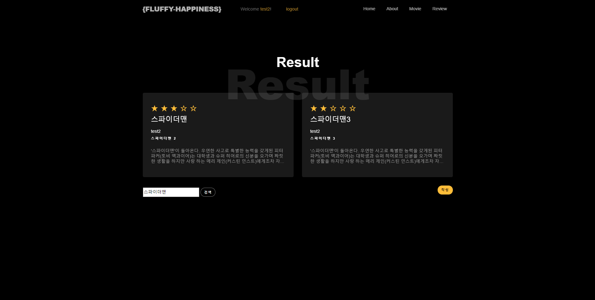       | 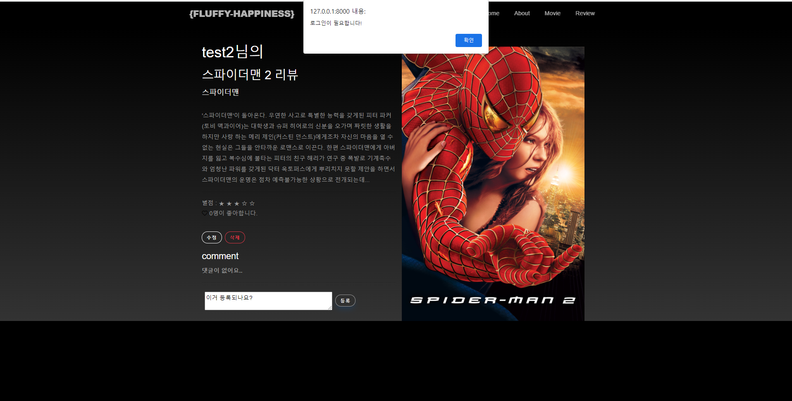 |              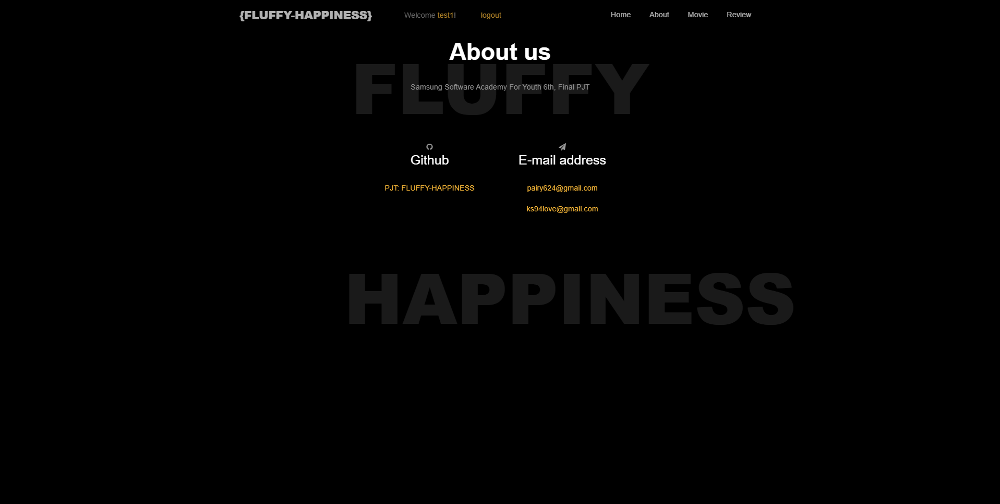               |
    |                       `Review Search`                        |                 `Movie Comment Verification`                 |                           `About`                            |


### 3. ERD

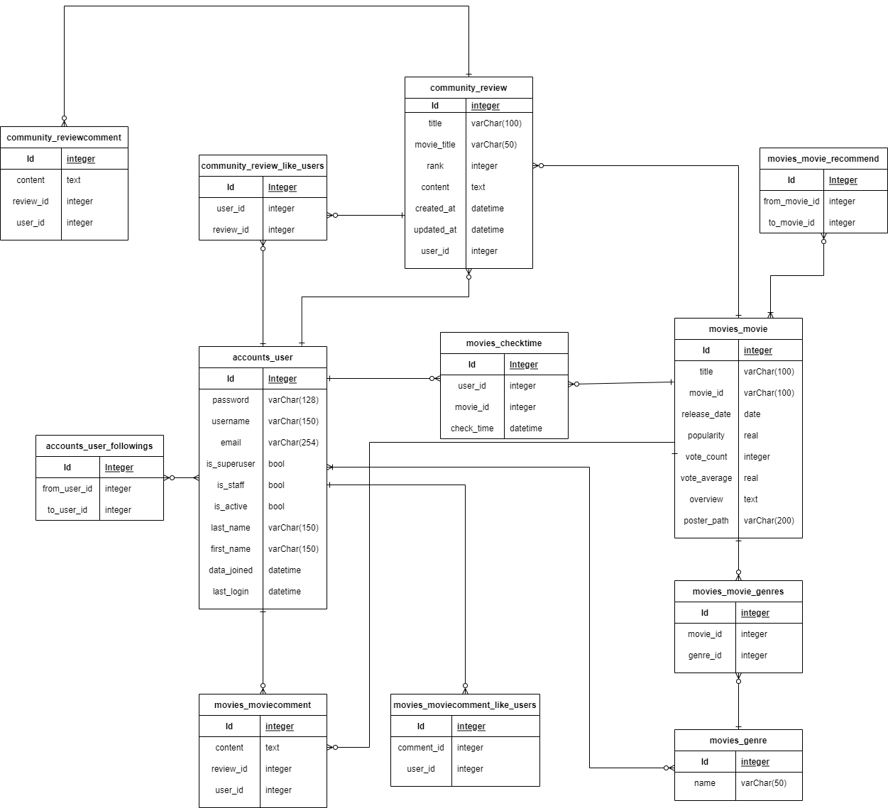

###  4. 주요기능

- #### 홈 화면 추천 기능

  

  :framed_picture: 6개의 추천 영화들이 나오고 있는 홈 화면

  - 사용자가 특정 영화를 보았다고 표시하면 DB에 표시 시각을 저장
  - M:N관계를 이용하여 사용자가 본 영화들을 모두 조회하고 그 중 가장 최근에 본 영화를 검색
  - 해당 영화가 가지고 있는 `recommend`필드에 저장된 추천 영화들을 홈 화면에서 출력


- #### 프로필 장르 태그

  

  :framed_picture: test1 유저의 장르 태그(`#액션` `#드라마` `#범죄`)

  - 사용자가 본 영화들을 `views.py`에서 조회한 다음 장르별로 개수를 카운트하고 가장 많이 시청한 3개의 장르를 선택하여 프로필 페이지에서 출력

  - 작성 코드

    ```python
    most_genres = {} # 영화별 장르 카운트를 저장할 dict
    for movie in host_movies: # 사용자가 본 영화들을 순회
        tmp_genres = movie.movie.genres.all() # 선택한 영화가 가진 모든 장르를 tmp_genres에 저장
        for genre in tmp_genres:
            if not most_genres.get(genre.name, 0): # tmp_genres를 순회하면서 장르들을 카운트
                most_genres[genre.name] = 1
            else:
                most_genres[genre.name] += 1
                
    most_genres = heapq.nlargest(3, most_genres, key=most_genres.get) # heapq 라이브러리를 사용하여 가장 많은 장르 3개만 저장
    ```


- #### 검색어 자동완성

​	:framed_picture: 리뷰 생성 페이지

- 자동완성 기능에서 더 나아가 검색한 영화를 클릭하면 해당 영화의 포스터가 왼쪽에 출력되도록 구현

- 코드 예시

  ```javascript
  <script>
      // 5. 화면에 비동기식으로 포스터 출력
      function selected_poster(path) {
          const poster = document.querySelector('#selected-poster')
          poster.style = `background-image: url("http://image.tmdb.org/t/p/original${path}"); background-size: contain;`
      }
  
  	// 1. 자동완성 기능 호출	
      new Autocomplete('#autocomplete', {
          		// 2. input = 사용자가 입력한 단어
            search : input => {
                
                ...
                // 3. 매 입력단위마다 요청을 보냄
              return new Promise(resolve => {
                if (input.length < 2) {
                  return resolve([])
                }
                fetch(url)
                .then(response => response.json())
                .then(response => {
                  resolve(response.data)
                })
              })
            },
           
  			...
            // 4. 사용자가 선택한 결과를 selected_poster 함수로 보냄
            onSubmit : result => {
              fn_selTest(result.title)
              selected_poster(result.poster_path)
            }
          })
  </script>
  ```

  

- #### 추천 알고리즘

  

​	:framed_picture: 영화 상세 페이지의 영화 추천

- Google Colab과 `tmdbv3api`라이브러리를 사용하여 tmdb api를 수집(약 9,000 개)

- `pandas`(json->dataframe)와 `nltk`(불용어 처리 및 tokenize)를 활용하여 학습 데이터 set 생성

- `gensim`라이브러리의 `word2vec`모델을 기본으로 아래와 같은 학습 모델 생성 및 학습

  ```python
  model = gensim.models.Word2Vec(preprocessed, window=5, min_count=3, sg=1, iter=1000)
  ```

  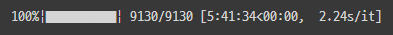

- 학습된 모델을 통해 영화 데이터들의 줄거리들에게 100차원 벡터를 부여하고 해당 벡터들의 중심값을 `scikit-learn`의 `Kmeas`를 라이브러리를 통해 도출
- 해당 중심 점들 코사인 유사도로 계산하여 각 영화별로 가까운 6개의 영화들을 `recommend` 필드에 저장


> `alien`단어와 가까운 100개의 단어들

| 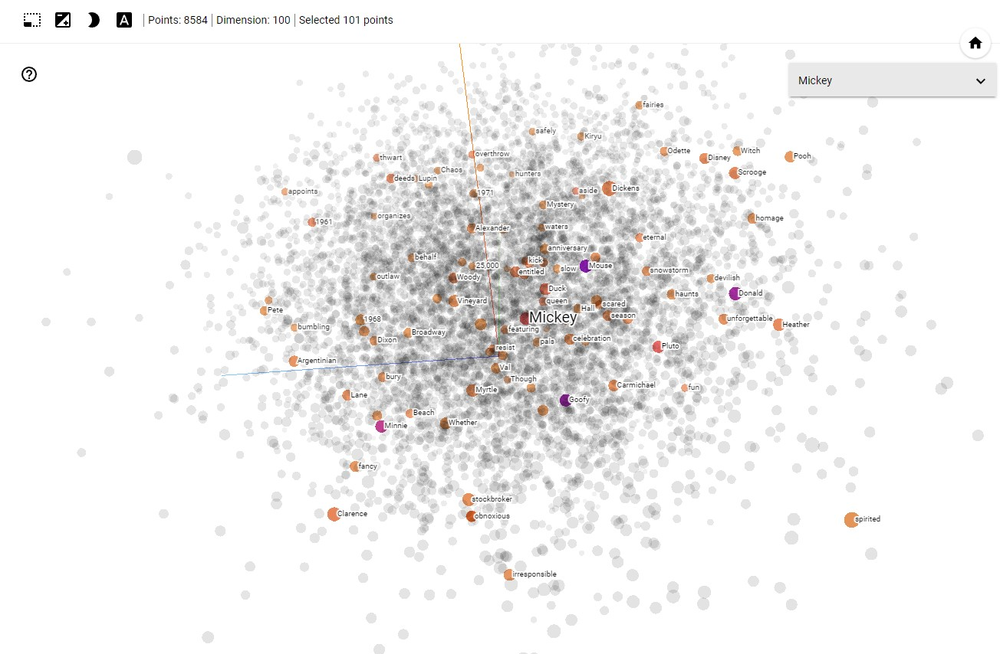 |  |
| :---------------------------------: | :-------------------------------------: |
|              `mickey`               |               `romantic`                |


### 5. 기타

- 추가해볼만 한 기능

  - 무비 index 속도 향상

  - 추천 알고리즘 방식 변화(단어 유사도 -> 문장 유사도)

    https://www.tensorflow.org/tutorials/text/word2vec#vectorize_sentences_from_the_corpus

  - 영화 index 페이지 렌더링 적용(실패했던 템플릿 도전)

- 지금까지의 큰 산들

  - `2021.11.18`: 별점 기능 사건
  - `2021.11.19`: datatime type 사건
  - `2021.11.22`: 템플릿 렌더링 사건
  - `2021.11.19 ~ 2021.11.24`: 자동 완성 사건

- 느낀 점

  - 💪김경수: "믿음의 중요성..."
  - 🦵최광호: "StackoverFlow 형님들 사..사랑합니다!"
